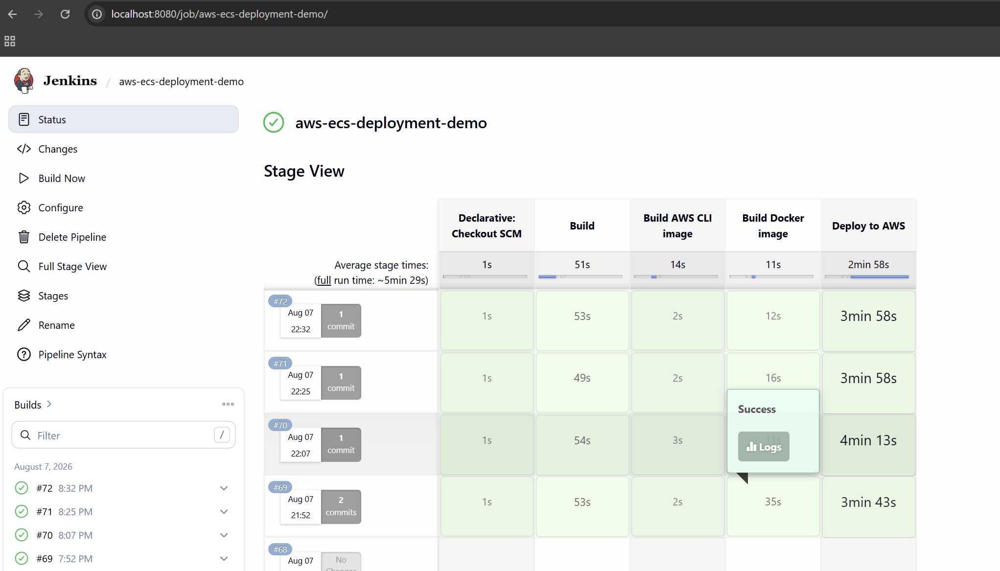

# AWS ECS Deployment Demo

A CI/CD pipeline that builds a React application, packages it into a Docker image, and deploys it to AWS ECS (Fargate) through Jenkins — fully automated from `git push` to a running container.

This project focuses less on the React app itself and more on the **deployment pipeline**: credential management, Docker-in-Docker builds, ECR image publishing, and zero-downtime ECS rolling updates.

## Architecture

```
┌─────────┐     ┌─────────┐     ┌──────────────┐     ┌─────────────┐     ┌─────────────┐
│  Git    │────▶│ Jenkins │────▶│ Docker Build │────▶│  AWS ECR    │────▶│  AWS ECS    │
│  Push   │     │Pipeline │     │   (image)    │     │ (registry)  │     │  (Fargate)  │
└─────────┘     └─────────┘     └──────────────┘     └─────────────┘     └─────────────┘
```

1. A push to `main` triggers the Jenkins pipeline.
2. The React app is built inside a `node:18-alpine` container.
3. A custom AWS CLI image is built to run Docker-in-Docker (needed since the base Jenkins agent has no AWS tooling).
4. The app is packaged into a Docker image and pushed to a private AWS ECR repository.
5. The ECS task definition is registered with the new image, and the ECS service is updated with a rolling deployment — Jenkins waits until the service reports stable before finishing.

## Pipeline stages

| Stage | What it does |
|---|---|
| **Build** | Installs dependencies and builds the production React bundle |
| **Build AWS CLI image** | Builds a custom Docker image containing the AWS CLI + Docker, used by later stages |
| **Build Docker image** | Builds the app image and pushes it to ECR, tagged with the Jenkins build number |
| **Deploy to AWS** | Registers a new ECS task definition revision and updates the ECS service, then waits for the deployment to stabilize |

**Successful pipeline run:**



## Tech stack

- **CI/CD:** Jenkins (Declarative Pipeline)
- **Containerization:** Docker, Docker-in-Docker agents
- **Cloud:** AWS ECR (container registry), AWS ECS Fargate (container orchestration)
- **Frontend:** React (Create React App)
- **Secrets management:** Jenkins Credentials Store (AWS keys and account ID are never hardcoded in the pipeline)

## What this project demonstrates

- Structuring a multi-stage Jenkins pipeline with per-stage Docker agents
- Building and running a Docker-in-Docker workflow to publish images from inside a CI job
- Managing secrets safely with Jenkins `withCredentials` and masked environment variables
- Templating an ECS task definition (`aws/task-definition-prod.json`) and injecting build-time values with `sed`
- Performing a rolling deployment on ECS and blocking the pipeline until the service is confirmed stable

## Project status

This pipeline was built and tested end-to-end — every stage above ran successfully, including a live deployment to AWS ECS. The AWS infrastructure (ECR repository, ECS cluster and service) and the Netlify preview site have since been decommissioned to avoid ongoing cloud costs, which is standard practice for demonstration projects.

## Running locally

```bash
npm install
npm start
```

Opens the app at [http://localhost:3000](http://localhost:3000).

To build the production bundle:

```bash
npm run build
```

## Repository structure

```
├── aws/                        # ECS task definition template
├── ci/                         # Dockerfile for the AWS CLI build agent
├── src/                        # React application source
├── Dockerfile                  # Production image (nginx + static build)
├── Jenkinsfile                 # Pipeline definition
└── README.md
```
